# 05 / Configuración de la VPC

Antes de crear cualquier instancia EC2, es necesario tener lista la infraestructura de red sobre la que van a correr. Esta sección cubre la creación y configuración completa de la VPC, las subnets, el Internet Gateway, las tablas de ruteo y los Security Groups. Todo esto lo ejecuta el **Líder** desde su cuenta root.

---

## Paso 1 / ¿Por qué crear una VPC propia?

AWS asigna automáticamente una VPC por defecto a cada cuenta en cada región. Sin embargo, en esta actividad creamos una VPC propia por las siguientes razones:

- Tener control total sobre los rangos de IP de la red.
- Separar el Master (accesible desde internet) de los Workers (red interna únicamente).
- Aplicar reglas de seguridad diferenciadas por subnet.
- Reflejar una arquitectura más cercana a lo que se usa en entornos reales de producción.

---

## Paso 2 / Crear la VPC

1. En la consola de AWS, buscar `VPC` en la barra de búsqueda y seleccionar el servicio.
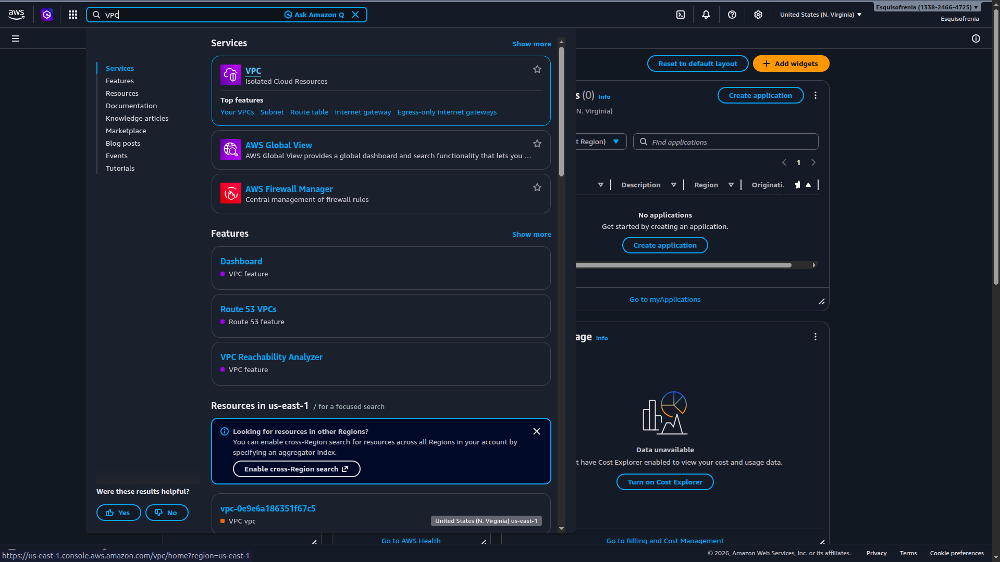
2. En el panel izquierdo ir a **Your VPCs** → hacer clic en `Create VPC`.
3. Completar los campos así:

| Campo               | Valor              |
|:--------------------|:-------------------|
| **Name tag**        | `VPC-DATA-CLUSTER` |
| **IPv4 CIDR block** | `10.0.0.0/16`      |
| **IPv6 CIDR block** | No IPv6 CIDR block |
| **Tenancy**         | Default            |
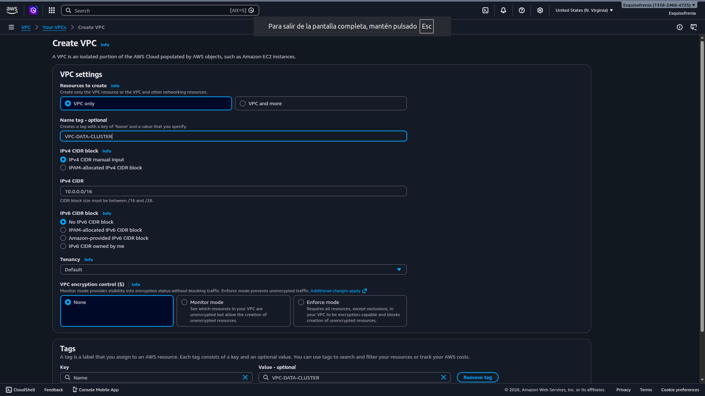
4. Hacer clic en `Create VPC`.


Una vez creada, la VPC aparecerá en el listado con estado **Available** y el rango `10.0.0.0/16`.

> 💡 El rango `/16` permite hasta 65.536 direcciones IP internas, suficiente para subdividir la red en múltiples subnets sin quedarse sin espacio.

---

## Paso 3 / Crear la Subnet Pública (Master)

La subnet pública es donde vivirá la instancia Master. Tendrá acceso a internet a través del Internet Gateway que se configura más adelante.

1. En el panel izquierdo ir a **Subnets** → `Create subnet`.
2. En **VPC ID** seleccionar `VPC-DATA-CLUSTER`.
3. Completar los campos de la subnet:

| Campo                 | Valor                  |
|:----------------------|:-----------------------|
| **Subnet name**       | `SUBNET-PUBLIC-MASTER` |
| **Availability Zone** | Sin preferencia        |
| **IPv4 CIDR block**   | `10.0.1.0/24`          |

4. Hacer clic en `Create subnet`.

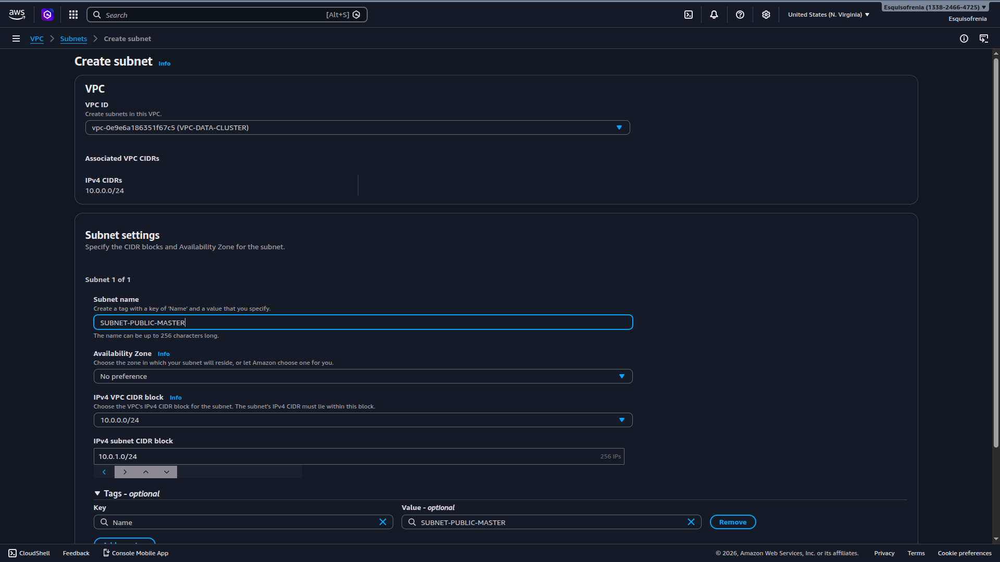

> 💡 El rango `10.0.1.0/24` otorga 256 direcciones IP dentro de esta subnet, más que suficiente para el Master.

---

## Paso 4 / Crear la Subnet Privada (Workers)

La subnet privada es donde vivirán las instancias Worker. No tendrá salida a internet, por lo que los Workers solo pueden comunicarse dentro de la VPC.

1. En **Subnets** → `Create subnet`.
2. En **VPC ID** seleccionar `VPC-DATA-CLUSTER`.
3. Completar los campos:

| Campo                 | Valor                    |
|:----------------------|:-------------------------|
| **Subnet name**       | `SUBNET-PRIVATE-WORKERS` |
| **Availability Zone** | Sin preferencia          |
| **IPv4 CIDR block**   | `10.0.2.0/24`            |

4. Hacer clic en `Create subnet`.

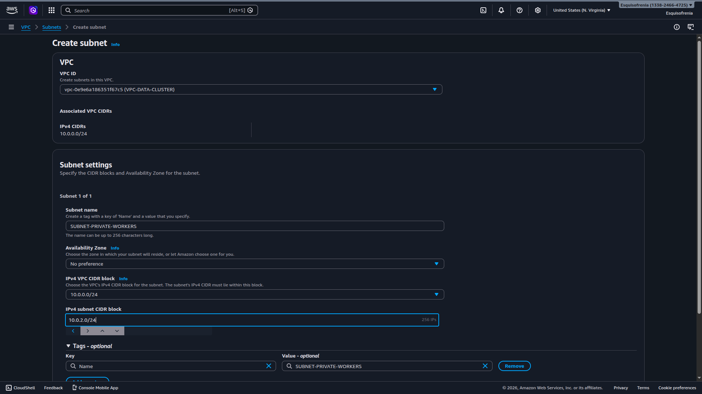

---

## Paso 5 / Crear el Internet Gateway

El Internet Gateway (IGW) es el componente que permite que la subnet pública tenga salida a internet. Sin él, ni siquiera el Master podría ser accesible desde fuera de la VPC.

1. En el panel izquierdo ir a **Internet Gateways** → `Create internet gateway`.
2. Completar el campo:

| Campo        | Valor              |
|:-------------|:-------------------|
| **Name tag** | `IGW-DATA-CLUSTER` |

3. Hacer clic en `Create internet gateway`.

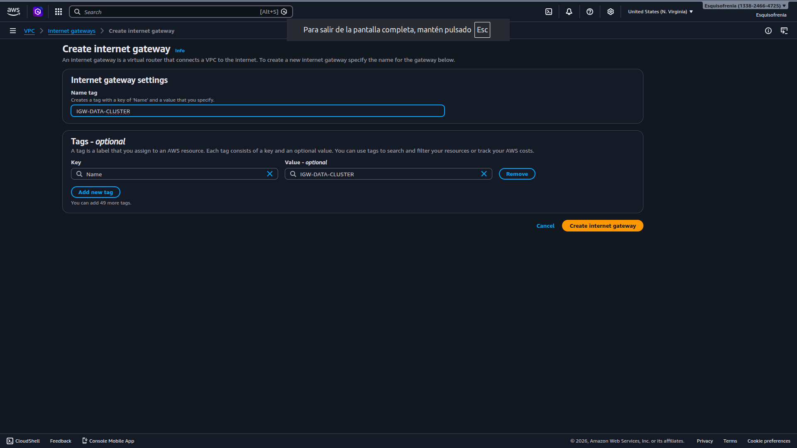

---

## Paso 6 / Asociar el Internet Gateway a la VPC

Una vez creado el IGW, su estado inicial es **Detached** — existe pero no está conectado a ninguna VPC todavía.

1. Seleccionar el IGW `IGW-DATA-CLUSTER` recién creado.
2. Hacer clic en **Actions** → `Attach to VPC`.
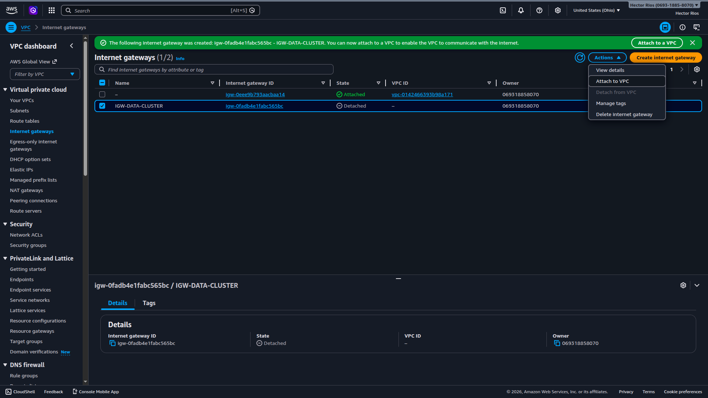
3. En el campo **VPC** seleccionar `VPC-DATA-CLUSTER`.
4. Hacer clic en `Attach internet gateway`.


El estado del IGW cambiará de `Detached` a `Attached`.

---

## Paso 7 / Configurar la Tabla de Ruteo pública

Por defecto, AWS crea una tabla de ruteo principal para la VPC que solo contiene la regla `local`. Es necesario crear una tabla de ruteo adicional para la subnet pública y agregarle la ruta hacia internet.

### 7.1 Crear la tabla de ruteo pública

1. En el panel izquierdo ir a **Route Tables** → `Create route table`.
2. Completar los campos:

| Campo | Valor |
|:---|:---|
| **Name** | `RT-PUBLIC` |
| **VPC** | `VPC-DATA-CLUSTER` |

3. Hacer clic en `Create route table`.

### 7.2 Agregar la ruta hacia internet

1. Seleccionar la tabla `RT-PUBLIC`.
2. Ir a la pestaña **Actions** → `Edit routes`.
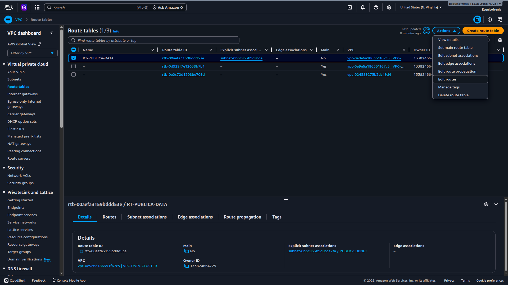
3. Hacer clic en `Add route` y completar:

| Campo | Valor |
|:---|:---|
| **Destination** | `0.0.0.0/0` |
| **Target** | Internet Gateway → `IGW-DATA-CLUSTER` |

4. Hacer clic en `Save changes`.

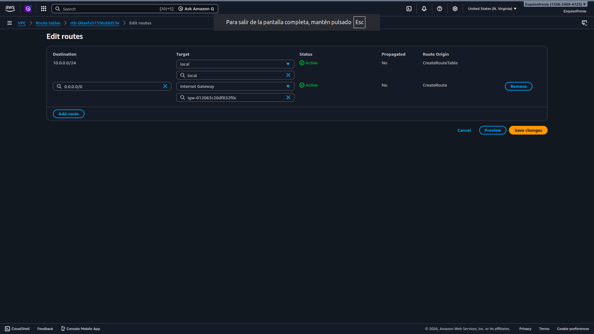

La tabla quedará con dos reglas:

| Destino | Target | Significado |
|:---|:---|:---|
| `10.0.0.0/16` | local | Tráfico interno de la VPC |
| `0.0.0.0/0` | IGW-DATA-CLUSTER | Todo el tráfico externo sale a internet |

### 7.3 Asociar la tabla de ruteo a la Subnet Pública

1. En la tabla `RT-PUBLIC` ir a la pestaña **Actions** → `Edit subnet associations`.
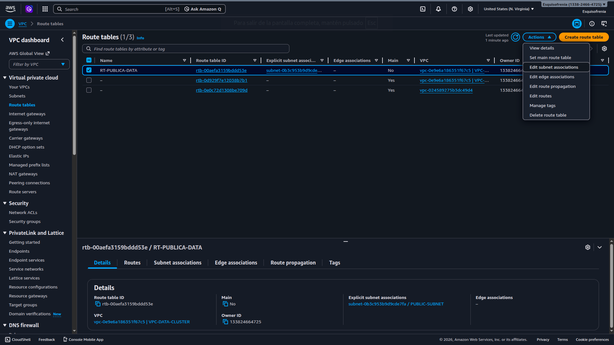
2. Seleccionar `SUBNET-PUBLIC-MASTER`.
3. Hacer clic en `Save associations`.

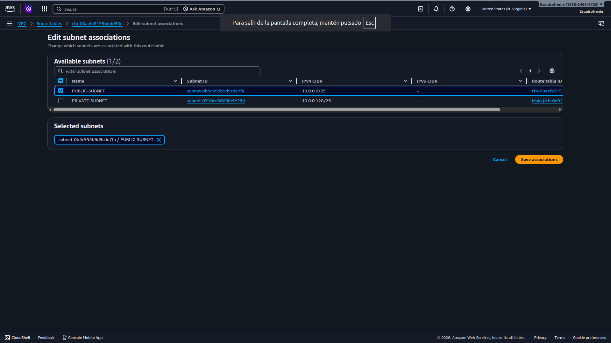

> ⚠️ Sin este paso la subnet pública seguiría usando la tabla de ruteo por defecto, que no tiene ruta a internet. La asociación es obligatoria.

---

## Paso 8 / Crear los Security Groups

Se crearon dos Security Groups con reglas diferenciadas: uno para el Master y otro para los Workers.

### 8.1 SG-Master — acceso SSH desde internet

Este Security Group permite que cualquier persona con la llave `.pem` correcta pueda conectarse al Master desde internet.

1. En el panel izquierdo ir a **Security Groups** → `Create security group`.
2. Completar los campos:

| Campo | Valor |
|:---|:---|
| **Security group name** | `SG-MASTER` |
| **Description** | Acceso SSH al nodo Master desde internet |
| **VPC** | `VPC-DATA-CLUSTER` |

3. En **Inbound rules** → `Add rule`:

| Tipo | Protocolo | Puerto | Origen |
|:---|:---|:---|:---|
| SSH | TCP | 22 | `0.0.0.0/0` |

4. Dejar **Outbound rules** con la regla por defecto (todo el tráfico permitido).
5. Hacer clic en `Create security group`.

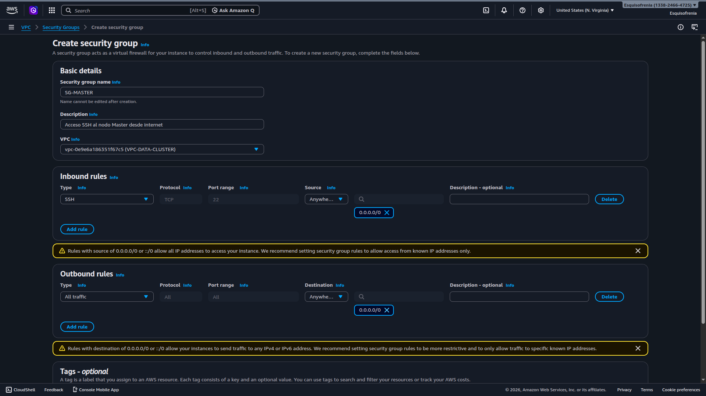

---

### 8.2 SG-Workers — acceso SSH solo desde el Master

Este Security Group restringe el acceso SSH a los Workers para que únicamente el Master pueda conectarse a ellos. Esto se logra especificando como origen el Security Group del Master en lugar de una IP.

1. En **Security Groups** → `Create security group`.
2. Completar los campos:

| Campo | Valor |
|:---|:---|
| **Security group name** | `SG-WORKERS` |
| **Description** | Acceso SSH a los Workers solo desde el Master |
| **VPC** | `VPC-DATA-CLUSTER` |

3. En **Inbound rules** → `Add rule`:

| Tipo | Protocolo | Puerto | Origen |
|:---|:---|:---|:---|
| SSH | TCP | 22 | `SG-MASTER` *(seleccionar el Security Group, no una IP)* |

4. Dejar **Outbound rules** con la regla por defecto.
5. Hacer clic en `Create security group`.

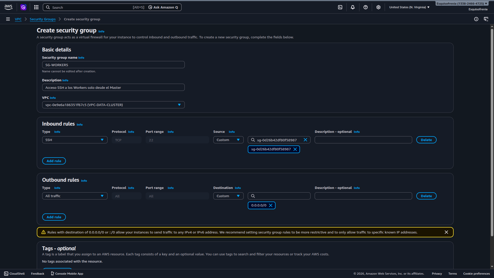

> 💡 Usar el Security Group como origen en lugar de una IP fija es la práctica correcta en AWS. De esta forma, cualquier instancia que tenga asignado `SG-MASTER` podrá conectarse a los Workers, sin depender de una IP que puede cambiar.

---

## Paso 9 / VPC Endpoint — intento fallido

Durante la actividad se intentó configurar un **VPC Endpoint** para que las instancias Worker pudieran comunicarse con Amazon S3 sin necesidad de salir a internet. Esto era especialmente relevante para los Workers, que al estar en la subnet privada no tienen acceso a internet por diseño.

Sin embargo, al intentar crear el endpoint, toda la clase recibió el siguiente error:

```text
Error
The AWS Access Key Id needs a subscription for the service
```

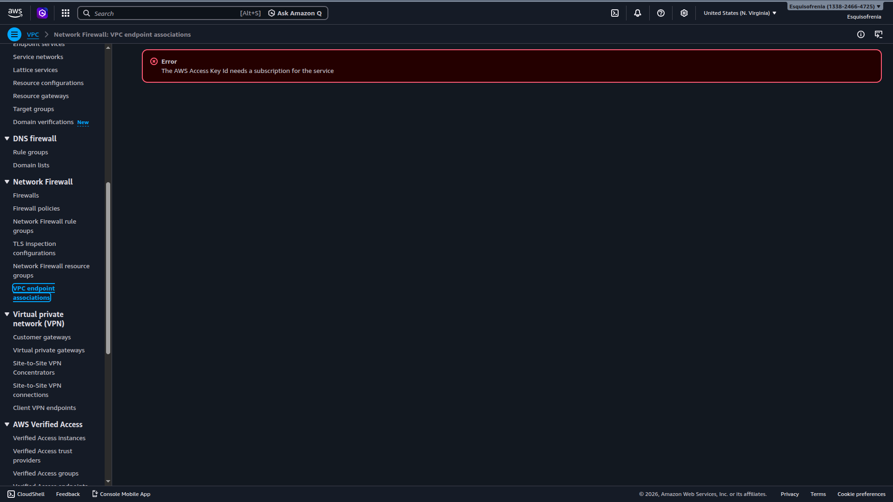

**¿Qué significa este error?**

El VPC Endpoint para S3 es un servicio que en ciertas condiciones requiere una suscripción activa o un nivel de cuenta que no estaba disponible en las cuentas académicas usadas durante la actividad. No es un error de configuración sino una limitación de la cuenta.

**¿Cómo se resolvió?**

El VPC Endpoint quedó por fuera del alcance de la actividad. La comunicación con S3 desde los Workers no se implementó en esta sesión.