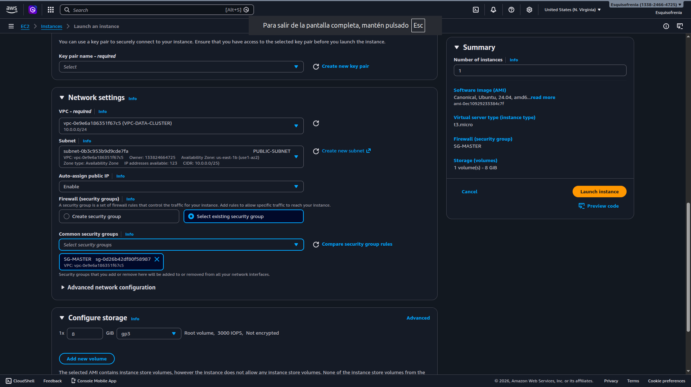

# 06 / Creación de las instancias EC2

Con la VPC, las subnets y los Security Groups ya configurados, cada integrante del equipo puede proceder a crear su instancia EC2. El proceso base es el mismo para todos, pero hay diferencias importantes según el rol: el Master va en la subnet pública con IP pública habilitada, y los Workers van en la subnet privada sin IP pública.

| Integrante | Instancia | Subnet | Security Group | IP pública |
|:---|:---|:---|:---|:---|
| Líder | `SRV-MASTER-DATA` | `SUBNET-PUBLIC-MASTER` | `SG-MASTER` | ✅ Sí |
| Ingeniero de Datos 2 | `SRV-WORKER-1` | `SUBNET-PRIVATE-WORKERS` | `SG-WORKERS` | ❌ No |
| Analista de Datos 1 | `SRV-WORKER-2` | `SUBNET-PRIVATE-WORKERS` | `SG-WORKERS` | ❌ No |
| Analista de Datos 2 | `SRV-WORKER-3` | `SUBNET-PRIVATE-WORKERS` | `SG-WORKERS` | ❌ No |

---

## 6.1 / El Líder crea el Master

### Paso 1 / Ingresar a EC2 y lanzar una instancia

1. Iniciar sesión con el usuario IAM del Líder.
2. En la barra de búsqueda escribir `EC2` y seleccionar el servicio.


3. En el panel izquierdo ir a **Instances** → hacer clic en `Launch instances`.

---

### Paso 2 / Nombre de la instancia

En el campo **Name** escribir:

```text
SRV-MASTER-DATA
```

---

### Paso 3 / Elegir la AMI

En la sección **Application and OS Images** seleccionar:

```text
Ubuntu Server 22.04 LTS (HVM), SSD Volume Type
Architecture: 64-bit (x86)
```

> 💡 Verificar que diga **Free tier eligible**.

---

### Paso 4 / Tipo de instancia

En **Instance type** seleccionar:

```text
t3.micro
```

---

### Paso 5 / Crear el Key Pair

1. En la sección **Key pair (login)** hacer clic en `Create new key pair`.
2. Completar los campos:

| Campo                       | Valor            |
|:----------------------------|:-----------------|
| **Key pair name**           | `SRV-MASTER-KEY` |
| **Key pair type**           | RSA              |
| **Private key file format** | `.pem`           |

3. Hacer clic en `Create key pair`. El archivo `.pem` se descargará automáticamente.


> ⚠️ Este archivo se descarga **una sola vez**. Si se pierde, no es posible recuperarlo y se perderá el acceso a la instancia permanentemente.

---

### Paso 6 / Configurar Network settings

Este es el paso más importante de la creación del Master, ya que aquí se asocia la instancia a la infraestructura de red que configuramos en la sección anterior.

En la sección **Network settings** hacer clic en `Edit` y configurar así:

| Campo                         | Valor                               |
|:------------------------------|:------------------------------------|
| **VPC**                       | `VPC-DATA-CLUSTER`                  |
| **Subnet**                    | `SUBNET-PUBLIC-MASTER`              |
| **Auto-assign public IP**     | `Enable`                            |
| **Firewall (Security Group)** | Seleccionar existente → `SG-MASTER` |



> ⚠️ Verificar que **Auto-assign public IP** esté en `Enable`. Sin esto el Master no tendrá IP pública y no será posible conectarse a él desde internet.

En cuanto al tráfico entrante, dejar solo la regla SSH activada:

| Regla                                     | Acción                                   | Motivo                                                    |
|:------------------------------------------|:-----------------------------------------|:----------------------------------------------------------|
| **Allow SSH traffic from**                | ✅ Activar — origen: `Anywhere 0.0.0.0/0` | Permite conectarse al Master desde cualquier IP           |
| **Allow HTTPS traffic from the internet** | ☐ Desactivado                            | No se expone ningún servicio web seguro en esta actividad |
| **Allow HTTP traffic from the internet**  | ☐ Desactivado                            | No se expone ningún servicio web en esta actividad        |

> ⚠️ AWS mostrará una advertencia en amarillo indicando que el origen `0.0.0.0/0` permite acceso desde cualquier IP. Para esta actividad académica es aceptable. En entornos productivos siempre se debe restringir a IPs conocidas.

---

### Paso 7 / Almacenamiento

En la sección **Configure storage** configurar así:

```text
64 GiB — gp3
```

---

### Paso 8 / Lanzar la instancia

1. Revisar el resumen en el panel derecho y verificar que la subnet y el Security Group sean los correctos.
2. Hacer clic en `Launch instance`.
3. Hacer clic en `View all instances`.


4. Esperar a que el estado cambie de `Pending` → `Running` y que **Status check** muestre `2/2 checks passed`.

---

### Paso 9 / Obtener el DNS público y compartirlo con el equipo

Una vez la instancia esté en estado `Running`:

1. Hacer clic sobre la instancia `SRV-MASTER-DATA`.
2. En la pestaña **Details** localizar el campo **Public IPv4 DNS**.
3. Copiarlo y enviarlo al canal del equipo con el siguiente formato:

```text
Instancia: SRV-MASTER-DATA
DNS: ec2-XX-XX-XX-XX.compute-1.amazonaws.com
```


> ⚠️ El DNS público cambia cada vez que la instancia se apaga y se vuelve a encender. Si en algún momento la conexión desde Termius falla, este es el primer valor que se debe verificar y actualizar.

---

## 6.2 / Cada Worker crea su instancia

El proceso es el mismo que el del Master. Los pasos de Nombre, AMI, tipo de instancia, Key Pair, almacenamiento y lanzado son idénticos. Las diferencias están en el **paso 6 de Network settings** y en lo que se comparte al final.

### Nombres por rol

| Integrante           | Nombre de la instancia |
|:---------------------|:-----------------------|
| Ingeniero de Datos 2 | `SRV-WORKER-1`         |
| Analista de Datos 1  | `SRV-WORKER-2`         |
| Analista de Datos 2  | `SRV-WORKER-3`         |

---

### Paso 6 / Configurar Network settings (Workers)

Esta es la única diferencia importante respecto al Master. Los Workers van en la subnet privada, sin IP pública y con el Security Group de Workers.

| Campo                         | Valor                                |
|:------------------------------|:-------------------------------------|
| **VPC**                       | `VPC-DATA-CLUSTER`                   |
| **Subnet**                    | `SUBNET-PRIVATE-WORKERS`             |
| **Auto-assign public IP**     | `Disable`                            |
| **Firewall (Security Group)** | Seleccionar existente → `SG-WORKERS` |

> ⚠️ Verificar que **Auto-assign public IP** esté en `Disable`. Los Workers no deben tener IP pública ya que solo se comunican dentro de la VPC a través del Master.

---

### Al finalizar — compartir la IP privada con el Líder

Los Workers no tienen DNS público, por lo que lo que se comparte con el Líder es la **IP privada** de cada instancia. Esta IP es la que el Líder usará para configurar el acceso SSH desde el Master.

Para obtenerla:

1. Hacer clic sobre la instancia Worker recién creada.
2. En la pestaña **Details** localizar el campo **Private IPv4 address**.
3. Copiarlo y enviarlo al Líder por el canal del equipo con el siguiente formato:

```text
Instancia: SRV-WORKER-1
IP privada: 10.0.2.XXX

Instancia: SRV-WORKER-2
IP privada: 10.0.2.XXX

Instancia: SRV-WORKER-3
IP privada: 10.0.2.XXX
```

> 💡 A diferencia del DNS público del Master, la IP privada de los Workers **no cambia** al apagar y encender la instancia, siempre que se mantenga dentro de la misma subnet. Esto hace la configuración SSH del Master más estable.