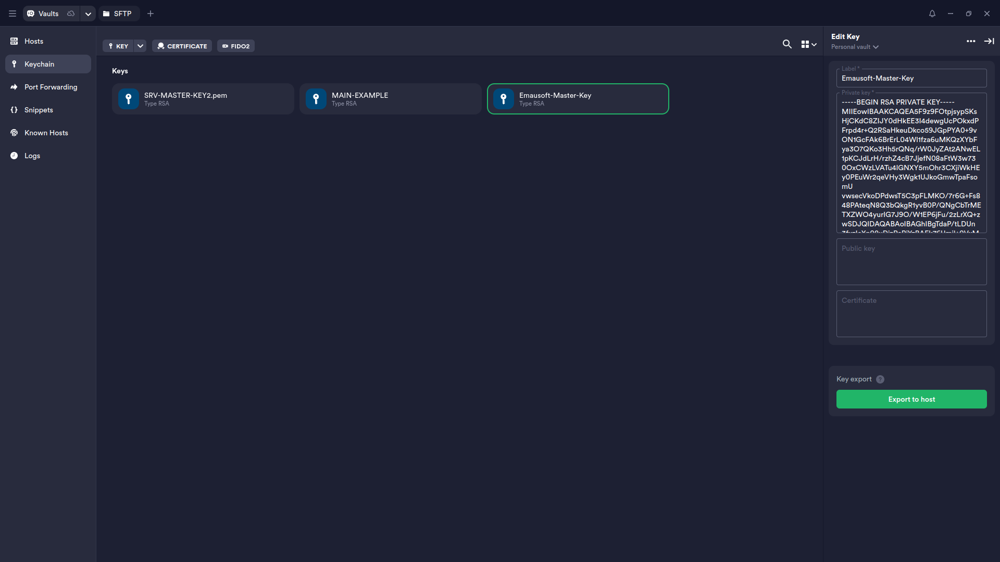
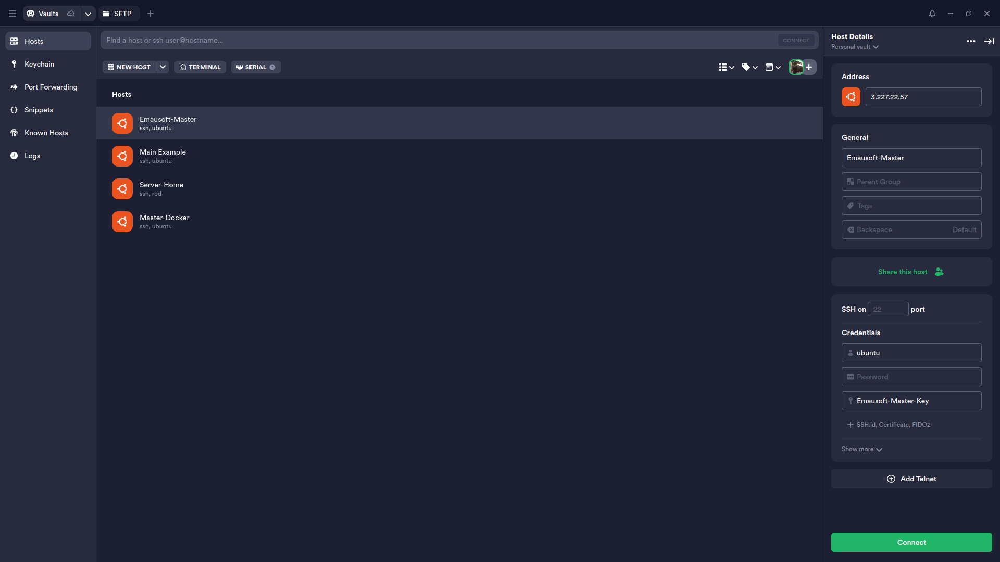
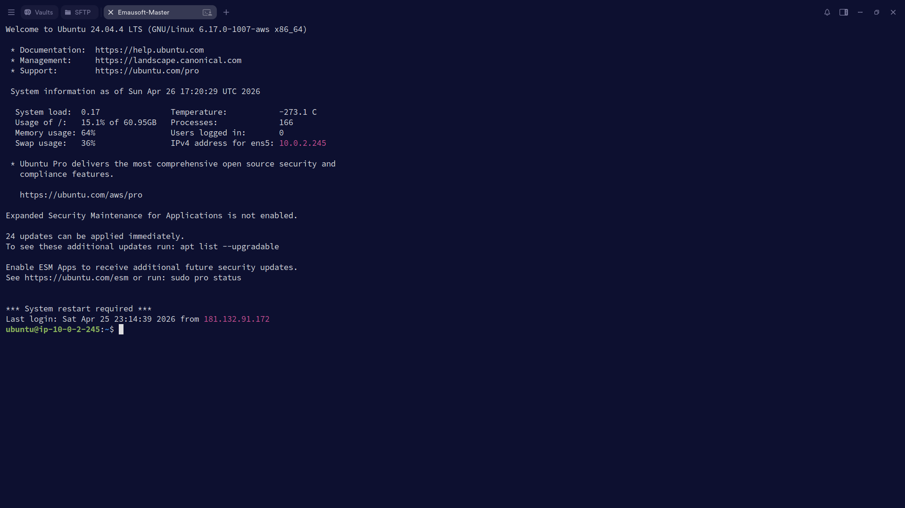
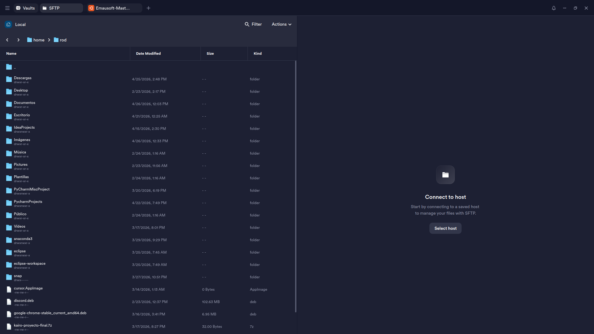
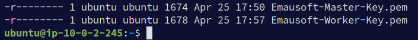
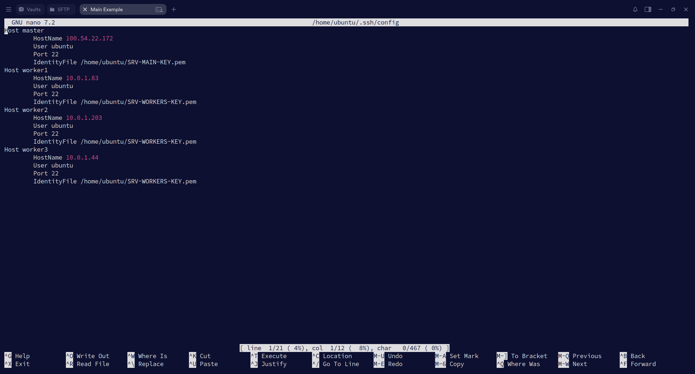
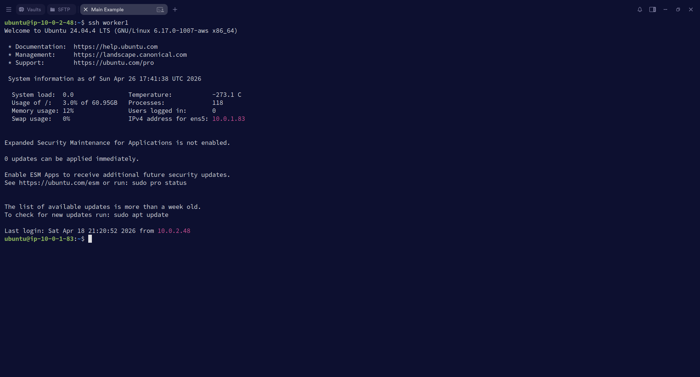

# 07 — Conectividad SSH Master → Workers

Hasta este punto ya tienes la VPC configurada, las instancias creadas y estás listo para establecer la conectividad completa del sistema. Esta sección explica cómo conectarse al Master desde tu PC usando Termius, cómo trasladarle las llaves de los Workers y cómo habilitar el acceso del Master hacia cada Worker por SSH.

---


## 7.1 — ¿Por qué el Master necesita la llave de los Workers?

Recuerda la arquitectura que construimos:

| Instancia  | Subnet                  | Accesible desde internet |
|:-----------|:------------------------|:-------------------------|
| `master`   | Pública (`10.0.1.0/24`) | ✅ Sí — tiene IP pública  |
| `worker-1` | Privada (`10.0.2.0/24`) | ❌ No — solo IP privada   |
| `worker-2` | Privada (`10.0.2.0/24`) | ❌ No — solo IP privada   |
| `worker-3` | Privada (`10.0.2.0/24`) | ❌ No — solo IP privada   |

Los Workers viven en una subnet privada. Eso significa que **no se pueden alcanzar directamente desde tu PC**. La única máquina que puede comunicarse con ellos es el Master, porque comparten la misma VPC y la tabla de ruteo local permite el tráfico interno.

La estrategia es la siguiente:

```
Tu PC  ──SSH──►  Master (subnet pública)  ──SSH──►  Worker (subnet privada)
```

A este patrón se le llama **Bastion Host** o nodo de salto: el Master actúa como intermediario. Para que ese salto funcione, el Master necesita tener la llave privada (`.pem`) de cada Worker, de la misma manera que tu PC necesita la llave del Master para conectarse a él.

---

## 7.2 — Crear el Host del Master en Termius y conectarse

Termius es el cliente SSH que usamos en esta actividad. Permite gestionar conexiones mediante una interfaz gráfica sin necesidad de escribir comandos cada vez.

### Crear el Keychain en Termius

El Keychain es el almacén de llaves dentro de Termius. Antes de crear el host, hay que registrar el archivo `.pem` del Master ahí.

1. Abrir Termius → en el panel izquierdo seleccionar **Keychain**.
2. Hacer clic en el botón `+` → **New Key**.
3. Asignar un nombre descriptivo, por ejemplo: `master-key`.
4. Seleccionar **Import from file** y cargar el archivo `master-key.pem` descargado al crear la instancia.
5. No le tienes que dar a ningun botón de guardar Termius ya te guarda automaticamente la Keychan.



### Crear el Host del Master en Termius

1. En el panel izquierdo seleccionar **Hosts** → hacer clic en `+` → **New Host**.
2. Completar los campos:

| Campo | Valor |
|:------|:------|
| **Label** | `master` (o cualquier nombre descriptivo) |
| **Address** | DNS público de la instancia Master, copiado desde la consola de AWS |
| **Username** | `ubuntu` |
| **Keys** | Seleccionar la llave `master-key` registrada en el Keychain |

3. Guardar el host.

> ⚠️ El DNS público tiene el formato `ec2-XX-XX-XX-XX.compute-1.amazonaws.com`. Cópialo desde la consola de AWS → EC2 → seleccionar la instancia → campo **Public IPv4 DNS**. Este valor cambia cada vez que la instancia se apaga y se vuelve a encender.



### Verificar conexión con el Master

Hacer doble clic sobre el host `master` en Termius. Si la configuración es correcta, se abrirá una terminal con el prompt de la instancia:

```
ubuntu@ip-10-0-1-XX:~$
```



---

## 7.3 — Copiar los `.pem` de los Workers al Master

Para que el Master pueda autenticarse ante cada Worker, necesita sus llaves privadas. Hay tres formas de hacer esa transferencia dependiendo del sistema operativo y las herramientas que tengas disponibles.

### Opción A — Transferir con el panel SFTP de Termius

Termius incluye un panel SFTP que permite arrastrar y soltar archivos desde tu PC hacia la instancia, sin necesidad de usar comandos.

1. Con la sesión del Master abierta en Termius, buscar el ícono de **SFTP** en la barra lateral de la terminal.
2. Se abrirá un panel dividido: tu sistema de archivos local a la izquierda, el sistema de archivos del Master a la derecha.
3. En el panel derecho navegar hasta `/home/ubuntu/`.
4. En el panel izquierdo localizar los archivos `.pem` de cada Worker.
5. Arrastrar cada archivo desde el panel izquierdo hacia el panel derecho.



---

### Opción B — Transferir con `scp` desde Windows

`scp` (Secure Copy Protocol) es una herramienta de línea de comandos que permite copiar archivos entre máquinas de forma segura usando SSH. Está disponible de forma nativa en PowerShell desde Windows 10.

#### ¿Necesito dar permisos al `.pem` antes de ejecutar `scp` en Windows?

**No.** Windows no tiene el sistema de permisos de Unix, por lo que el archivo `.pem` se usa directamente desde PowerShell sin ninguna configuración previa. El comando funciona tal como está, sin pasos adicionales.

> ⚠️ Lo que sí debes hacer es asegurarte de que la ruta al archivo sea correcta. Una ruta incorrecta es el error más común al ejecutar `scp` desde Windows.

#### Ejecutar el comando desde PowerShell

Abre PowerShell y ejecuta un comando por cada llave que necesitas transferir:

```powershell
scp -i "C:\Users\TuNombre\Downloads\master-key.pem" "C:\Users\TuNombre\Downloads\worker1-key.pem" ubuntu@54.123.45.67:/home/ubuntu/
scp -i "C:\Users\TuNombre\Downloads\master-key.pem" "C:\Users\TuNombre\Downloads\worker2-key.pem" ubuntu@54.123.45.67:/home/ubuntu/
scp -i "C:\Users\TuNombre\Downloads\master-key.pem" "C:\Users\TuNombre\Downloads\worker3-key.pem" ubuntu@54.123.45.67:/home/ubuntu/
```

| Parte del comando | Descripción |
|:------------------|:------------|
| `-i "...master-key.pem"` | La llave con la que te autenticas ante el Master |
| `"...workerX-key.pem"` | El archivo que quieres enviar |
| `ubuntu@54.123.45.67` | Usuario e IP pública del Master |
| `:/home/ubuntu/` | Carpeta de destino dentro del Master |

> 💡 Si usas **Git Bash** en Windows, puedes escribir las rutas con `/` en lugar de `\`, igual que en Linux o macOS.

> 💡 Una vez que el `.pem` llega al Master (que corre Linux), sí deberás ajustar sus permisos ahí adentro. Eso se hace en el [paso 7.5](#75--ajustar-permisos-del-config-y-los-pem).

---

### Opción C — Transferir con `scp` desde Linux o macOS

En Linux y macOS el archivo `.pem` tiene el sistema de permisos de Unix, por lo que antes de poder usarlo con `scp` hay que restringir sus permisos. Si no lo haces, el comando fallará con la siguiente advertencia:

```
WARNING: UNPROTECTED PRIVATE KEY FILE!
Permissions 0644 for 'master-key.pem' are too open.
```

#### Paso 1 — Ajustar permisos del `.pem` del Master en tu PC local

```bash
chmod 400 master-key.pem
```

Esto le dice al sistema que solo el propietario del archivo puede leerlo. SSH exige esta restricción antes de aceptar la llave.

#### Paso 2 — Ejecutar el comando desde tu terminal

```bash
scp -i "master-key.pem" worker1-key.pem ubuntu@54.123.45.67:/home/ubuntu/
scp -i "master-key.pem" worker2-key.pem ubuntu@54.123.45.67:/home/ubuntu/
scp -i "master-key.pem" worker3-key.pem ubuntu@54.123.45.67:/home/ubuntu/
```

> 💡 Si los archivos `.pem` no están en el mismo directorio donde abriste la terminal, escribe la ruta completa, por ejemplo: `/Users/TuNombre/Downloads/worker1-key.pem`.

---

### Verificar que los archivos llegaron correctamente

Independientemente del método que usaste, conéctate al Master y lista el contenido del directorio home:

```bash
ls -la /home/ubuntu/
```

Deberías ver todos los archivos `.pem` transferidos:

```
-rw------- 1 ubuntu ubuntu 1674 Jan  1 10:00 master-key.pem
-rw------- 1 ubuntu ubuntu 1674 Jan  1 10:00 worker1-key.pem
-rw------- 1 ubuntu ubuntu 1674 Jan  1 10:00 worker2-key.pem
-rw------- 1 ubuntu ubuntu 1674 Jan  1 10:00 worker3-key.pem
```



---

## 7.4 — Editar `~/.ssh/config` con nano

El archivo `~/.ssh/config` permite definir alias para cada conexión SSH. En lugar de escribir el comando completo con IP, usuario y llave cada vez que quieres conectarte a un Worker, defines cada entrada una sola vez y luego usas simplemente `ssh worker1`.

### Abrir o crear el archivo con nano

Desde la terminal del Master:

```bash
nano ~/.ssh/config
```

Si el archivo no existe, `nano` lo crea automáticamente.

### Contenido del archivo

Copia y pega el siguiente bloque, reemplazando las IPs con las reales de tu equipo:

```
Host master
    HostName 10.0.1.XX
    User ubuntu
    IdentityFile /home/ubuntu/master-key.pem

Host worker1
    HostName 10.0.2.XX
    User ubuntu
    IdentityFile /home/ubuntu/worker1-key.pem
    ProxyJump master

Host worker2
    HostName 10.0.2.XX
    User ubuntu
    IdentityFile /home/ubuntu/worker2-key.pem
    ProxyJump master

Host worker3
    HostName 10.0.2.XX
    User ubuntu
    IdentityFile /home/ubuntu/worker3-key.pem
    ProxyJump master
```

### Explicación línea por línea

| Directiva | Descripción |
|:----------|:------------|
| `Host` | El alias con el que invocarás la conexión, por ejemplo `ssh worker1` |
| `HostName` | La IP privada real de la instancia |
| `User` | El usuario del sistema operativo. En instancias Ubuntu de AWS siempre es `ubuntu` |
| `IdentityFile` | Ruta completa al archivo `.pem` que SSH usará para autenticarse |
| `ProxyJump` | Indica que SSH debe pasar primero por el host señalado antes de llegar al destino final |

El bloque `Host master` existe para que los bloques de los Workers puedan referenciar a `master` en `ProxyJump`. Sin él, SSH no sabría cómo llegar al Master cuando intenta hacer el salto.

### Guardar y salir de nano

Una vez escrito el contenido:
- `Ctrl + O` → escribir los cambios al archivo
- `Enter` → confirmar el nombre del archivo
- `Ctrl + X` → salir de nano



---

## 7.5 — Ajustar permisos del `config` y los `.pem`

SSH en Linux rechaza las conexiones cuando las llaves privadas o el archivo `config` tienen permisos demasiado abiertos. Este paso es obligatorio; sin él, los comandos del siguiente paso fallarán con una advertencia como esta:

```
WARNING: UNPROTECTED PRIVATE KEY FILE!
Permissions 0644 for 'worker1-key.pem' are too open.
```

### Ajustar permisos de los `.pem`

```bash
chmod 400 worker1-key.pem
chmod 400 worker2-key.pem
chmod 400 worker3-key.pem
```

### Ajustar permisos del `config`

```bash
chmod 600 ~/.ssh/config
```

### ¿Qué significan estos permisos?

| Comando | Propietario | Grupo | Otros | Cuándo se usa |
|:--------|:------------|:------|:------|:--------------|
| `chmod 400` | Solo lectura ✅ | Sin acceso ❌ | Sin acceso ❌ | Llaves privadas `.pem` |
| `chmod 600` | Lectura y escritura ✅ | Sin acceso ❌ | Sin acceso ❌ | Archivo `config` |

Los tres dígitos representan los permisos del propietario, el grupo y los demás usuarios, en ese orden. Cada dígito es la suma de los bits de lectura (`4`), escritura (`2`) y ejecución (`1`). Por ejemplo, `6 = 4 + 2`, es decir, lectura y escritura.

### Verificar que los permisos quedaron correctos

```bash
ls -la *.pem ~/.ssh/config
```

La salida debe verse así:

```
-r-------- 1 ubuntu ubuntu 1674 Jan  1 10:00 worker1-key.pem
-r-------- 1 ubuntu ubuntu 1674 Jan  1 10:00 worker2-key.pem
-r-------- 1 ubuntu ubuntu 1674 Jan  1 10:00 worker3-key.pem
-rw------- 1 ubuntu ubuntu  312 Jan  1 10:00 /home/ubuntu/.ssh/config
```

`-r--------` corresponde a `400`. `-rw-------` corresponde a `600`.

---

## 7.6 — Probar la conexión desde el Master hacia cada Worker

Con el archivo `config` guardado y los permisos correctos, ejecuta los siguientes comandos desde la terminal del Master.

### Conectarse a Worker 1

```bash
ssh worker1
```

Si todo está bien configurado, verás el prompt de bienvenida de Ubuntu dentro del Worker:

```
Welcome to Ubuntu 22.04.X LTS...
ubuntu@ip-10-0-2-XX:~$
```

Para cerrar la sesión del Worker y volver al Master:

```bash
exit
```

### Conectarse a Worker 2

```bash
ssh worker2
```

### Conectarse a Worker 3

```bash
ssh worker3
```



### Tabla resumen de conexiones

| Desde | Hacia | Método | Requiere ProxyJump |
|:------|:------|:-------|:-------------------|
| Tu PC | Master | Termius (doble clic) | ❌ No |
| Master | Worker 1 | `ssh worker1` | ✅ Sí |
| Master | Worker 2 | `ssh worker2` | ✅ Sí |
| Master | Worker 3 | `ssh worker3` | ✅ Sí |

> ⚠️ Si la conexión falla, lo primero que hay que revisar es que la IP privada del Worker en el `config` coincida exactamente con la que aparece en la consola de AWS. Un solo dígito incorrecto impide la conexión.